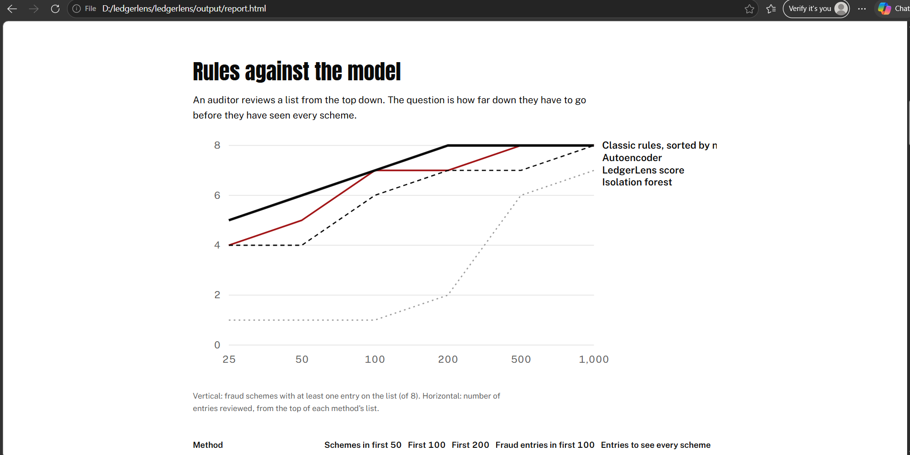

<div align="center">

# LedgerLens

### Auditors get 2,368 flagged journal entries. LedgerLens showed every fraud scheme in the first 160.

**Anomaly detection, an AI copilot that investigates with ledger tools, and an audit report, built for journal entry testing under ISA 240.**


</div>

<br>

[LedgerLens workbench](docs/images/workbench.png) 
[LedgerLens workbench](docs/images/finding.png) 
[LedgerLens workbench](docs/images/finding2.png) 


| On a ledger of 198,053 entries with 8 hidden fraud schemes | Classic audit rules | LedgerLens |
|---|:---:|:---:|
| **Entries to review before every scheme shows up** | 2,368 flagged (208 if sorted) | **160** |
| Schemes in the first 50 entries | 5 | **6** |
| Fraud entries in the first 100 | 28 | **35** |

<sub>Fictional company, synthetic data. Method chosen on a development ledger (seed 7), results reported on a fresh test ledger (seed 11).</sub>

---

## The problem

Every audit must test journal entries for fraud, because managers can override controls through them (ISA 240). Today that mostly means rules: weekend postings, round amounts, entries just below the approval limit. Rules are easy to explain, but they flag thousands of entries, and most of them are normal. A nightly invoicing batch is "after hours". Rent is a round amount. Auditors end up sampling, and fraud hides in the part nobody looks at.

## What LedgerLens does

1. **Learns what normal looks like for each person and account.** Posting at 22:00 is normal for the invoicing system. It is not normal for the payroll officer at 02:00 on a Sunday.
2. **Ranks every entry**, combining the classic rules with an autoencoder that spots entries unusual in several small ways at once.
3. **Explains every flag in plain language.** For example: *"Posted at 02:14, while Eva Bos usually posts around 11:05."*
4. **Sends a copilot to investigate.** An LLM agent looks up the entry, the person, the supplier and related entries using read-only tools, then writes a draft finding.
5. **Checks the copilot's work.** Every number and ID in a draft must exist in what the tools returned. Invented figures are marked before an auditor sees them.
6. **Leaves the decision to the auditor**, in a workbench where they mark a finding or dismiss it, with a note for the audit file.

<!-- Add a screenshot of a copilot draft finding here:  -->

---

## Results per scheme

Position of the first entry of each scheme on the list (lower is better):

| Hidden scheme | LedgerLens | Classic rules |
|---|---:|---:|
| Fictitious revenue at quarter end | **1** | 1 |
| Self-approved cash journals | **3** | 7 |
| Cash booked to miscellaneous expenses | **5** | 10 |
| Ghost supplier | **13** | 47 |
| Expenses moved to fixed assets at year end | 20 | **12** |
| Night-time postings by the payroll officer | **37** | 67 |
| Duplicate supplier invoices | **64** | 66 |
| Payments split under the approval limit | **160** | 208 |

The rules win on one scheme, and that's in the table on purpose. The model is better at things rules cannot express ("unusual *for this person*"), and the rules carry audit knowledge the model cannot learn, which is why the score uses both.

> [!NOTE]
> **Copilot results:** add the numbers from your own run with `ledgerlens all` (share of drafts that passed the number check, and share of fraud entries the copilot called suspicious).

---

## What this project shows

| Skill | Where you can see it |
|---|---|
| **Audit knowledge** | Journal entry testing under ISA 240, 13 classic tests, 8 fraud schemes based on common patterns, an audit-style report |
| **Unsupervised ML** | Feature design relative to user and account behaviour, autoencoder against isolation forest, no labels in training |
| **Honest evaluation** | Separate development and test ledgers, a metric that matches how auditors work, the result where rules win included |
| **AI agents** | Tool calling with a JSON protocol, a step budget, fallback when the model fails, and an automatic check of every number |
| **Product thinking** | A workbench where the auditor stays in charge, with explanations and a decision trail |
| **Engineering** | Typed Python package, 14 tests, CI, Docker, one command to run on a laptop |

---

## Run it

Python 3.10 or newer.

```bash
python -m venv .venv
# Windows: .venv\Scripts\Activate.ps1    macOS or Linux: source .venv/bin/activate
pip install -e ".[dev]"

ledgerlens all --provider simulated     # about one minute, no model needed
```

With a real model (install [Ollama](https://ollama.com) first):

```bash
ollama pull llama3.1:8b
ledgerlens all                          # the copilot investigates the top 15 entries
ledgerlens serve                        # workbench at http://127.0.0.1:8000
```

The report is in `output/report.html`. Use `--scale 0.2` for a smaller ledger, and `--top 5` to let the copilot investigate fewer entries.

<details>
<summary><b>All commands</b></summary>

| Command | What it does |
|---|---|
| `ledgerlens all` | Generate, analyze, investigate and report |
| `ledgerlens generate` | Write the ledger |
| `ledgerlens analyze` | Run the rules and models, score them against the hidden schemes |
| `ledgerlens investigate` | Let the copilot investigate the top of the list |
| `ledgerlens report` | Write the HTML report |
| `ledgerlens explain JE012345` | Show why one entry is on the list |
| `ledgerlens serve` | Start the workbench |
| `ledgerlens doctor` | Check the model connection and output files |

</details>

<details>
<summary><b>Repository structure</b></summary>

```
configs/default.yaml     settings (ledger size, seed, model, copilot)
docs/                    architecture and methodology
src/ledgerlens/
  data/                  ledger generator and fraud schemes
  audit/                 risk features and classic rules
  ml/                    detectors, explanations, evaluation
  copilot/               agent, ledger tools, number check
  reporting/             HTML report
  api/                   workbench API and page
tests/                   14 tests, offline
```

</details>

---

## Limitations

- The company and data are synthetic, and the same person wrote the fraud schemes and the detector. Real fraud is more varied.
- The copilot's numbers are checked, its conclusions are not. Every draft needs an auditor's judgement.
- Not yet tested on real company data, which is the next step.

---

## About me

**Victoria Vicheva**, AI and data consultant.

- Master's student in Data-Driven Business at The Hague University of Applied Sciences
- Bachelor's in Applied Data Science and AI, cum laude, Breda University of Applied Sciences
- AI and data consulting experience at Deloitte

Also see my other project, **LLM Assurance Lab**: red teaming and hardening an AI assistant for a bank. Together they cover both sides of AI in assurance: making AI systems trustworthy, and using AI to make audits better.

[LinkedIn](https://www.linkedin.com/in/YOUR-PROFILE) | [Email](mailto:YOUR-EMAIL)
