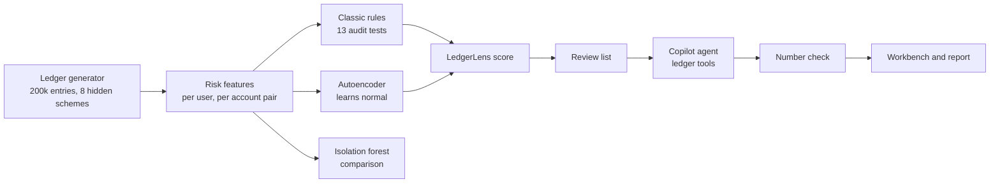

# Architecture

| Step | What happens | Code |
|---|---|---|
| Ledger | A year of bookkeeping from real business processes, plus planted fraud. The answers go to a separate file. | `data/generator.py`, `data/schemes.py` |
| Features | 23 risk features. Many are relative: unusual for this user, rare for this account combination, unusual for this supplier. | `audit/features.py` |
| Rules | 13 yes or no tests auditors use today. Time tests skip scheduled system batches. | `audit/rules.py` |
| Models | Autoencoder (main) and isolation forest (comparison), trained without labels. | `ml/detectors.py` |
| Score | Average rank of the autoencoder and the rule count. | `ml/detectors.py` |
| Reasons | Every flag gets plain sentences: "Posted at 02:14, while Eva Bos usually posts around 11:05." | `ml/explain.py` |
| Copilot | An LLM agent that calls 5 read-only ledger tools, then writes a draft finding as JSON. | `copilot/agent.py`, `copilot/tools.py` |
| Number check | Every number and ID in a draft must appear in what the tools returned. | `copilot/grounding.py` |
| Evaluation | The only code that reads the answers. | `ml/evaluate.py` |
| Output | Workbench (FastAPI) and an HTML report. | `api/`, `reporting/` |

## Design decisions

**Relative features beat absolute rules.** "Posted after 20:00" flags every nightly batch. "Posted far outside this person's normal hours" does not. Most of the model's advantage comes from this.

**Rules stay in the score.** Rules encode audit knowledge that a model cannot learn from unlabelled data, such as the approval limit. The autoencoder adds what rules cannot express: combinations of small oddities.

**The copilot never sees the answers and cannot write.** Its tools are read-only lookups. It can be wrong, so its output is a draft, the number check marks invented figures, and the auditor decides.

**A simulated model for tests.** `llm/simulated.py` follows the same JSON protocol as a real model, so tests and CI run offline in seconds.

**Synthetic data, honest evaluation.** The combination of rules and autoencoder was chosen on seed 7 and is reported on seed 11, a ledger the method was not tuned on.
