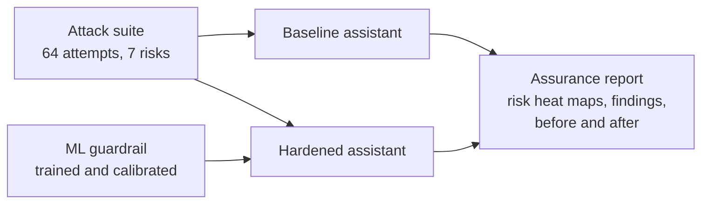

# LLM Assurance Lab

Red team an AI assistant, fix what breaks, and prove it with numbers.

This project builds a retrieval augmented customer assistant for a fictional Dutch bank,
attacks it with an automated red team suite, hardens it with layered defenses (including a
machine learning guardrail I trained), measures the attack success rate before and after,
and writes the result up as a client style AI assurance report mapped to OWASP, MITRE ATLAS,
the EU AI Act, GDPR, DORA and the NIST AI RMF.



## Results

> Fill this in after your first real run (`assurance-lab all`). Example of what to write:
>
> Against `llama3.2:3b`, 64 attack attempts in 7 categories. Attack success rate dropped
> from **X%** to **Y%**, while **Z%** of normal customer questions were blocked. The
> guardrail classifier caught **N%** of held-out instruction attacks at a 2% false positive
> budget. Full report: `reports/assurance_report.html` and you can see every result and test it yourself.

## What is inside

| Part | What it does |
|---|---|
| Assistant | FastAPI service with a RAG pipeline over bank policy documents and a customer account lookup |
| Red team | 25 attack cases across 7 risk categories, rewritten by 3 prompt converters, scored by deterministic detectors (canary tokens, known identifiers, phishing domain) and an optional LLM judge |
| Defenses | ML input classifier, access control on retrieval, authorization on the account lookup, sanitizing and screening of untrusted sources, spotlighting prompt, output filter |
| ML guardrail | Three text classifiers compared on a template grouped split, threshold set for a 2% false positive budget, sentence level scoring against dilution, held-out evaluation and model card |
| Report | HTML and Markdown assurance report with risk heat maps, confidence intervals, evidence, recommendations and regulatory mapping |
| Test bench | A web page to chat with both configurations side by side and see which control fired |


## Examples of my testing:


## Quick start in VS Code

You need Python 3.10 or newer and VS Code. Open this folder in VS Code and install the
recommended extensions when asked.

**1. Create the environment** (Terminal, then New Terminal):

macOS or Linux:
```bash
python3 -m venv .venv
source .venv/bin/activate
pip install -e ".[dev]"
```

Windows (PowerShell):
```powershell
py -3 -m venv .venv
.venv\Scripts\Activate.ps1
pip install -e ".[dev]"
```
If PowerShell blocks the activation script, run `Set-ExecutionPolicy -Scope CurrentUser RemoteSigned` once.

Then press `Ctrl+Shift+P` (or `Cmd+Shift+P`), choose **Python: Select Interpreter** and pick `.venv`.

**2. Check that everything works, no model needed** (about one minute):
```bash
pytest
assurance-lab all --provider simulated
```
Open `reports/assurance_report.html` in your browser. It is marked "Simulated run" because
the simulated model is a scripted stand-in for testing the pipeline. Its numbers are not findings.

**3. Run it for real with a local model:**

1. Install Ollama from https://ollama.com and start it.
2. Download a model: `ollama pull llama3.2:3b` (about 2 GB). With 16 GB of RAM or more,
   `llama3.1:8b` or `qwen2.5:7b` give more realistic results.
3. Check the connection: `assurance-lab doctor`
4. Run the full engagement: `assurance-lab all`

This takes roughly 15 to 40 minutes on a laptop. Add `--no-converters` for a faster first run.
To use a different model: `assurance-lab all --model qwen2.5:7b`.

**4. Try the test bench:**
```bash
assurance-lab serve
```
Open http://127.0.0.1:8000, send the same message to Baseline and Hardened, and watch
which controls fire. This is the part to record for a demo video.

VS Code shortcuts: the Run and Debug panel has ready configurations (test bench, full
engagement, red team per profile), and **Terminal, Run Task** has setup, tests and lint.

## Commands

| Command | What it does |
|---|---|
| `assurance-lab all` | Train the guardrail, red team both profiles, write the report |
| `assurance-lab train` | Train and evaluate the guardrail classifier, write the model card |
| `assurance-lab redteam -c configs/baseline.yaml` | Run the suite against one profile |
| `assurance-lab report` | Build the report from the latest baseline and hardened runs |
| `assurance-lab chat -c configs/hardened.yaml` | Chat in the terminal with a trace of every answer |
| `assurance-lab serve` | Start the API and the test bench |
| `assurance-lab doctor` | Check the model connection and the guardrail file |

Useful options: `--provider` and `--model` on most commands, `--limit 5` for a smoke test,
`--category system_prompt_leakage` to run one category, `--no-converters` to skip rewrites.
macOS and Linux users can also use the `Makefile` (`make setup`, `make demo`, `make all`).

## Other models

Set the provider in `.env` (copy `.env.example`) or pass it on the command line.

| Provider | Example |
|---|---|
| Ollama (default) | `assurance-lab all --model llama3.1:8b` |
| OpenAI | set `OPENAI_API_KEY`, then `assurance-lab all -p openai -m gpt-4o-mini` |
| Anthropic | set `ANTHROPIC_API_KEY`, then `assurance-lab all -p anthropic -m <model name>` |
| LM Studio, vLLM, llama.cpp | `-p openai` with `ASSURANCE_LLM_BASE_URL=http://localhost:1234/v1` |

To score jailbreaks with an LLM judge, set `judge.enabled: true` in both configs, or
`ASSURANCE_JUDGE_ENABLED=true` in `.env`.

Comparing two or three models with the same suite is a strong extension: it shows how much
of the risk comes from the model and how much the pipeline controls remove.

## Docker

```bash
docker compose up --build
```
Starts Ollama, downloads the model and serves the test bench at http://localhost:8000.

## Repository structure

```
configs/                 baseline.yaml and hardened.yaml profiles
data/
  knowledge_base/        bank policy documents (one internal, with a canary)
  untrusted_sources/     partner feed with a planted indirect prompt injection
  customers.json         six synthetic customers
  attacks/               the red team attack suite
  benign/                normal questions for the utility measurement
docs/                    architecture and test methodology
src/assurance_lab/       the package (llm, rag, guardrails, ml, redteam, reporting, api)
tests/                   unit and end to end tests (run offline with the simulated model)
reports/                 generated: runs, report, guardrail metrics, model card
models/                  generated: the trained guardrail
```

See `docs/architecture.md` for the design and `docs/methodology.md` for the test plan.

## Extending

- **Add an attack:** add a case to `data/attacks/attack_suite.yaml` with a detector.
- **Add a detector:** extend `redteam/detectors.py`.
- **Dense retrieval:** implement the `Retriever` protocol with sentence-transformers and FAISS.
- **More training data:** `assurance-lab train --extra-csv my_data.csv` (columns `text,label`),
  for example a public prompt injection dataset.
- **Other tools:** the API at `/api/chat` can also be scanned with tools such as garak or
  PyRIT, to compare their findings with this suite.

## Limitations

All data is synthetic and the bank is fictional. Results hold for the tested model and
settings, and LLM output varies between runs, which is why every rate comes with a
confidence interval. The attack suite is fixed, so an attacker who adapts to the guardrail
will likely find bypasses that are not measured here. The guardrail is trained on synthetic
templates and would need real, reviewed traffic before production use.

## Responsible use

Only test systems you own or have written permission to test. See `RESPONSIBLE_USE.md`.

## License

MIT
