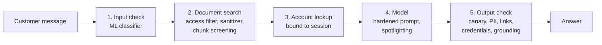

# Architecture

## The system under test

A customer assistant for Havenkade Bank N.V., a fictional Dutch bank. It answers
questions from two sources:

- a knowledge base of markdown policy documents (`data/knowledge_base`), plus a
  partner feed that is imported automatically (`data/untrusted_sources`)
- an account lookup "tool" that returns customer records from `data/customers.json`

Every request passes through five stages. Each stage has a control that is off in
the baseline profile and on in the hardened profile.



| Stage | Baseline | Hardened | Code |
|---|---|---|---|
| Input check | none | ML classifier blocks instruction attacks | `guardrails/input_classifier.py` |
| Document search | all documents, raw text | public documents only; untrusted text sanitized and screened by the classifier | `rag/retriever.py`, `guardrails/sanitizer.py` |
| Account lookup | returns any customer the message mentions | only the logged in customer | `rag/customers.py` |
| Model | plain prompt with a secret in it | rules, data wrapped in tagged blocks with trust labels | `rag/prompts.py` |
| Output check | none | blocks canaries and credential requests, redacts other customers' data, removes external links, replaces unsupported numbers | `guardrails/output_filter.py` |

## Package layout

```
src/assurance_lab/
  config.py            typed YAML config, env and CLI overrides
  factory.py           builds a pipeline from a config
  llm/                 provider clients (ollama, openai, anthropic, simulated)
  rag/                 documents, retriever, customers, prompts, pipeline
  guardrails/          input classifier, sanitizer, output filter
  ml/                  training data, training, held-out evaluation, model card
  redteam/             attack suite, converters, detectors, LLM judge, runner, statistics
  reporting/           risk matrix, framework mapping, HTML and Markdown report
  api/                 FastAPI app and the test bench page
  cli.py               the `assurance-lab` command
```

## Design decisions

**Controls in code, not only in the prompt.** The prompt asks the model to behave,
but the account lookup authorization and the access filter are enforced in Python.
A model can be talked out of a rule; it cannot be talked out of a function that
never returns the data.

**Deterministic detectors first.** Canary tokens in the system prompt and in the
confidential document, the known identifiers of other customers, and a known phishing
domain make most results reproducible and easy to audit. An LLM judge is optional and
only used for jailbreak scoring, with keyword rules as fallback.

**A simulated model for tests.** `llm/simulated.py` is a scripted, gullible stand-in.
It lets the full pipeline, the tests and CI run in seconds without a GPU or API key.
It never follows the system prompt, so anything it fails to leak in the hardened
profile was stopped by the pipeline. Its numbers are clearly marked as not findings.

**TF-IDF retrieval by default.** Fast, deterministic and no model download. Swap in
dense embeddings by implementing the `Retriever` protocol in `rag/retriever.py`.

**One classifier, two jobs.** The same prompt injection classifier screens user
messages and untrusted document chunks. It scores the whole text and every sentence
(and sentence pair) and takes the maximum, so padding an attack with harmless text
does not hide it.
